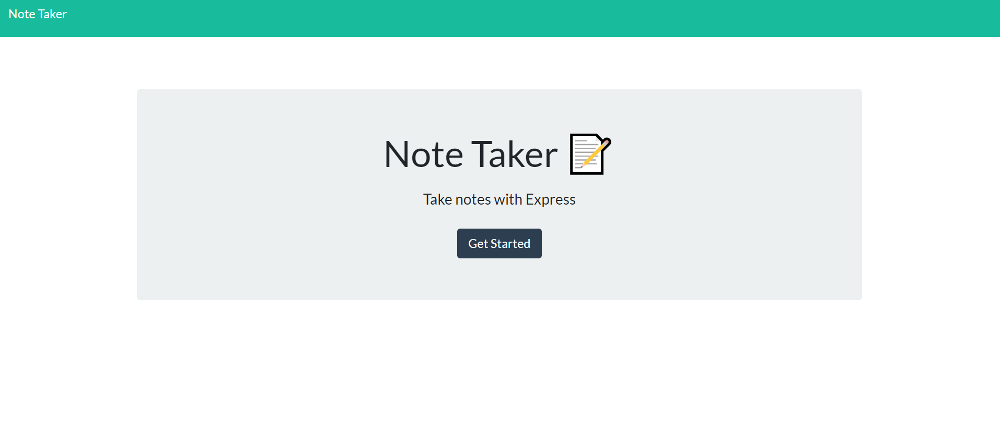
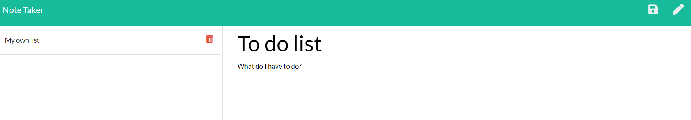
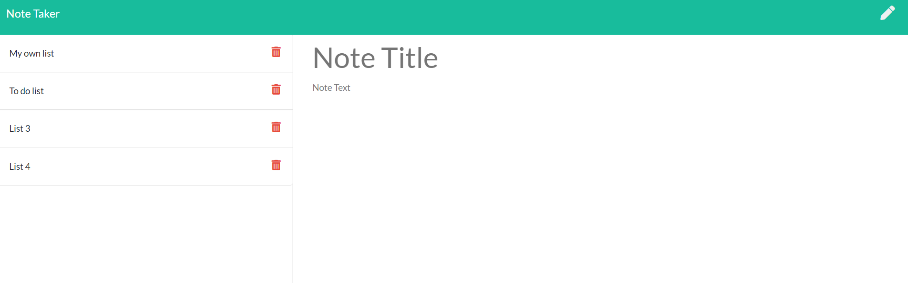
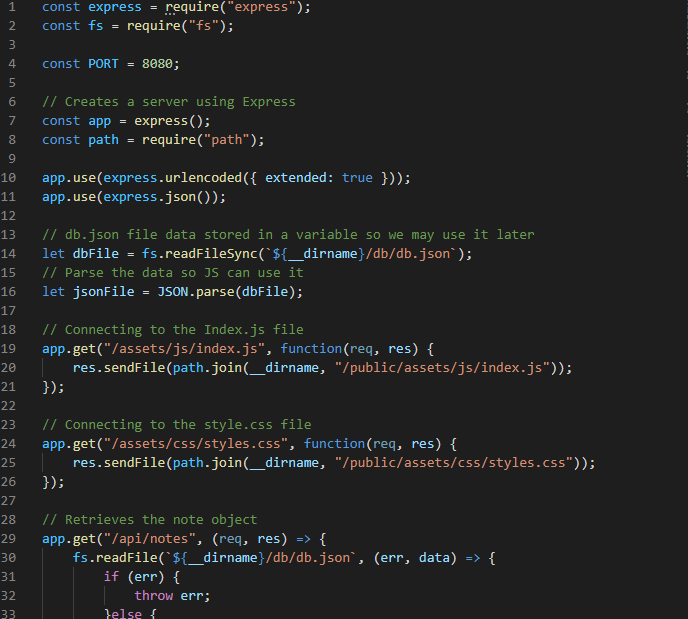
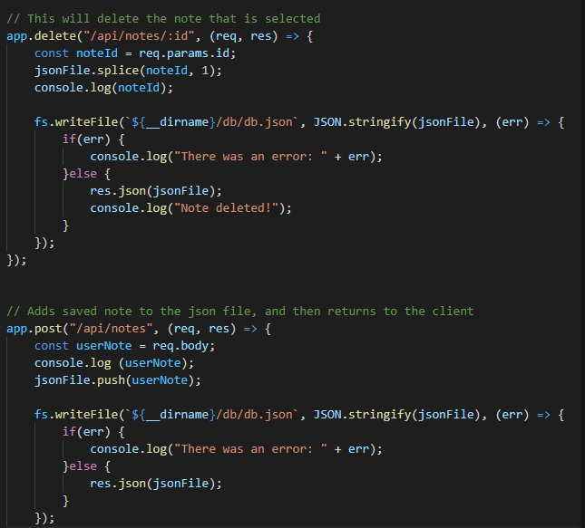

# Note-Taker
Application designed to write, save, and delete notes.

## Description 

This application is designed to let users write their own notes in the browser, save, and also delete them. 

For this assignment, we were tasked with creating a local server using the Express package. With Express, we could make the PORT number and we could make GET and POST requests to the server in order to update the webpage. 

## Table of Contents 

* [Description](#Description)
* [Installation](#Installation)
* [Usage](#Usage)
* [Credits](#Credits)
* [License](#License)
* [Contributions](#Contributions)
* [Tests](#Tests)
* [Questions](*Questions)

## Installation

In order to install this project, simply type in "npm install" within the terminal so you can install the needed dependencies.

## Usage

In order to use the project, you can type "nodemon server.js" within the terminal, and then you can navigate to the local host URL port. 

## Credits

Me! Alex Varela.

## License

MIT

## Contributing

The code here is free for you to use for your own purposes and you are free to edit it as you see fit.

## Tests

No tests were created for this application.

## Questions

You may contact me through email or my GitHub account.

Reach out to me!

Email: alexvar93@gmail.com
GitHub Profile: Fatmoogle || https://github.com/Fatmoogle 

---
© 2019 Trilogy Education Services, a 2U, Inc. brand. All Rights Reserved.

